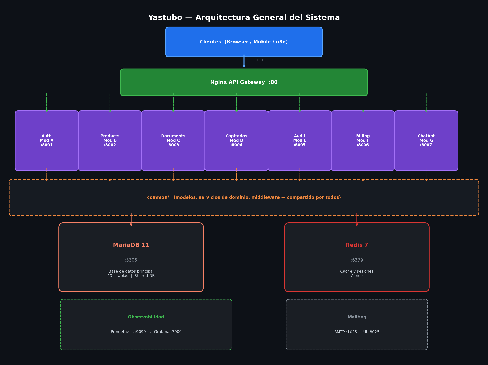
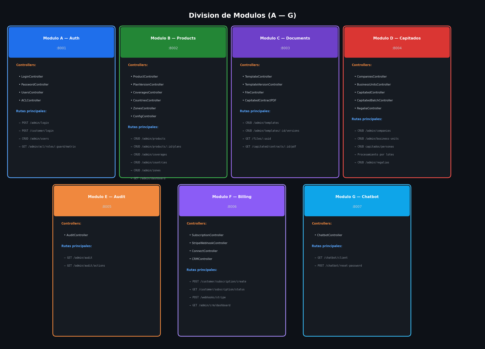
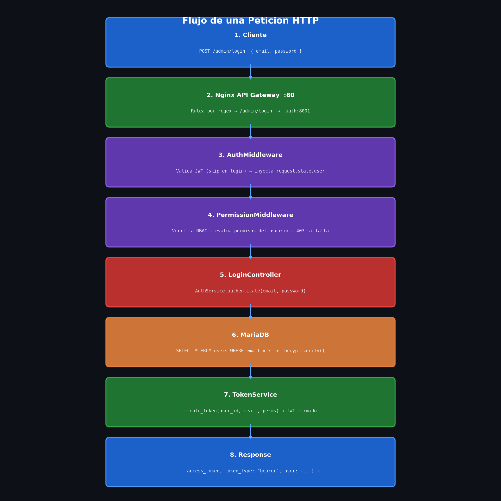
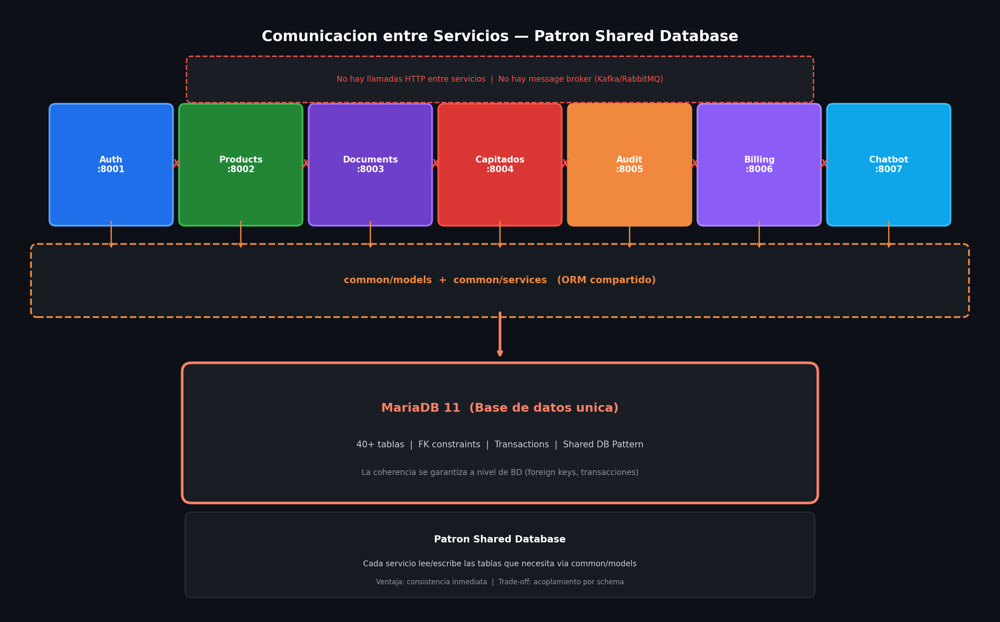
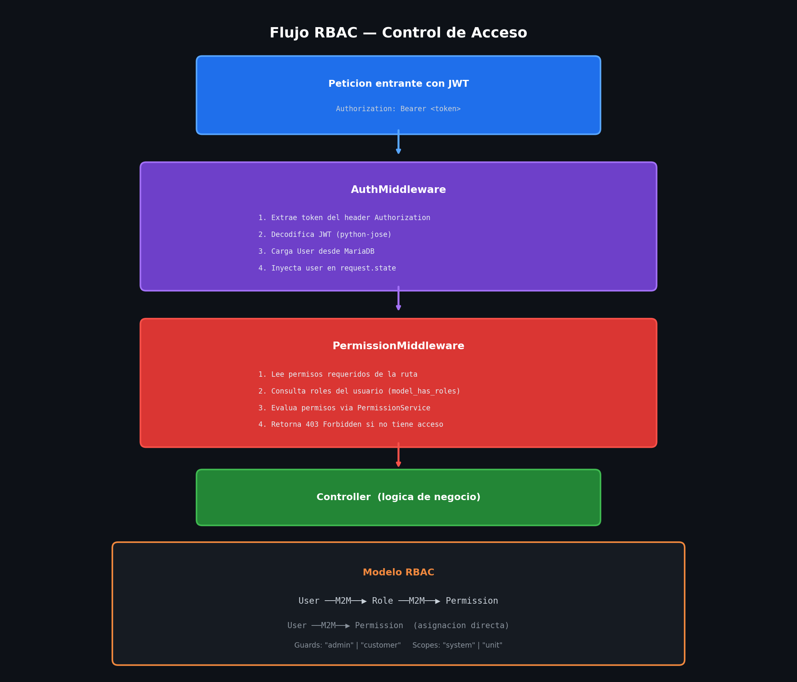
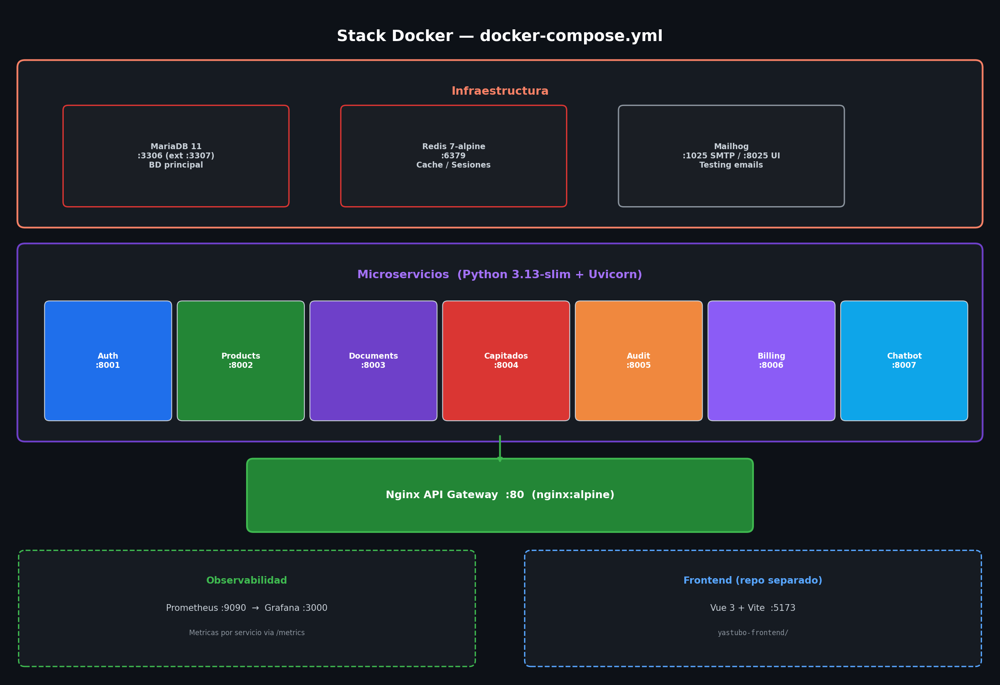
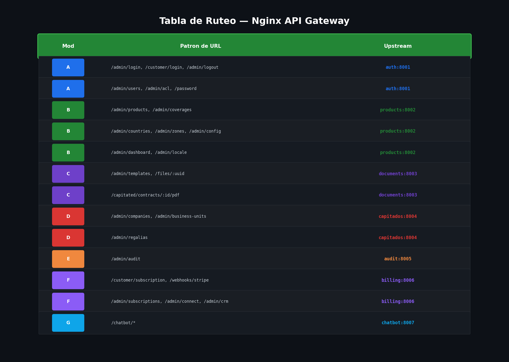

# Arquitectura del sistema

> Todos los diagramas estan disponibles como imagenes en [`docs/images/`](images/).

## Vista general

Yastubo Python es un backend compuesto por **7 microservicios** independientes
(Modulos A-G) que se despliegan como contenedores Docker. Todos comparten una
base de datos MariaDB y una instancia Redis, y se exponen al exterior a traves
de un unico API Gateway Nginx en el puerto 80.



```
    Clientes (Browser / Mobile / n8n)
                  |
                  | HTTPS
                  v
    +-----------------------------------+
    |        Nginx API Gateway          |
    |           Puerto 80               |
    |                                   |
    |  Ruteo por prefijo de URL:        |
    |  /admin/login  --> auth:8001      |
    |  /admin/products -> products:8002 |
    |  /admin/templates -> docs:8003    |
    |  /admin/companies -> capit:8004   |
    |  /admin/audit  --> audit:8005     |
    |  /customer/sub --> billing:8006   |
    |  /chatbot      --> chatbot:8007   |
    +--------+-----+-----+-------------+
             |     |     |
             v     v     v
    +--------+-----+-----+---------------------------+
    |                                                 |
    |              Red interna Docker                 |
    |                                                 |
    |   +--------+  +----------+  +-----------+       |
    |   | Auth   |  | Products |  | Documents |       |
    |   | :8001  |  | :8002    |  | :8003     |       |
    |   | Mod A  |  | Mod B    |  | Mod C     |       |
    |   +---+----+  +----+-----+  +-----+-----+      |
    |       |             |              |             |
    |   +--------+  +-----------+  +-----------+      |
    |   | Capit. |  | Audit     |  | Billing   |      |
    |   | :8004  |  | :8005     |  | :8006     |      |
    |   | Mod D  |  | Mod E     |  | Mod F     |      |
    |   +---+----+  +-----+-----+  +-----+-----+     |
    |       |              |              |            |
    |       |         +-----------+       |            |
    |       |         | Chatbot   |       |            |
    |       |         | :8007     |       |            |
    |       |         | Mod G     |       |            |
    |       |         +-----+-----+       |            |
    |       |               |             |            |
    |   +---+---+-----------+---+---------+---+        |
    |   |                                     |        |
    |   v                                     v        |
    | +-----------+                   +-----------+    |
    | | MariaDB   |                   | Redis     |    |
    | | 11        |                   | 7-alpine  |    |
    | | :3306     |                   | :6379     |    |
    | | (datos)   |                   | (cache/   |    |
    | |           |                   |  sesiones)|    |
    | +-----------+                   +-----------+    |
    |                                                  |
    +--------------------------------------------------+
```

---

## Division de modulos



Cada modulo es un servicio FastAPI independiente con su propio `Dockerfile`,
`main.py` y conjunto de controllers. Todos comparten el paquete `common/`
(modelos, servicios de dominio, middleware).

```
+------------------------------------------------------------------+
|                        Codigo compartido                         |
|                                                                  |
|  common/                                                         |
|  |-- models/        40+ modelos SQLAlchemy (User, Company, ...)  |
|  |-- services/      Logica de dominio (auth, PDF, billing, ...)  |
|  |-- middleware/     Auth JWT, permisos, recaptcha                |
|  |-- config.py      Settings (pydantic-settings)                 |
|  +-- database.py    Engine & session factory (async)             |
|                                                                  |
+-----+-----+-----+-----+-----+-----+-----+----------------------+
      |     |     |     |     |     |     |
      v     v     v     v     v     v     v
+------+ +------+ +------+ +------+ +------+ +------+ +------+
|Mod A | |Mod B | |Mod C | |Mod D | |Mod E | |Mod F | |Mod G |
|Auth  | |Prods | |Docs  | |Capit | |Audit | |Bill  | |Chat  |
|:8001 | |:8002 | |:8003 | |:8004 | |:8005 | |:8006 | |:8007 |
+------+ +------+ +------+ +------+ +------+ +------+ +------+
```

### Modulo A — Auth (puerto 8001)

Autenticacion, gestion de usuarios y control de acceso.

```
+-------------------------------------------------------+
|                    Auth Service                        |
|                                                        |
|  Controllers:                                          |
|  +-- LoginController      POST /admin/login            |
|  |                        POST /customer/login         |
|  +-- PasswordController   POST /admin/forgot-password  |
|  |                        POST /admin/reset-password   |
|  |                        POST /password/check         |
|  +-- UsersController      CRUD /admin/users            |
|  |                        POST /admin/users/:id/       |
|  |                             impersonate             |
|  +-- ACLController        GET  /admin/acl/roles/       |
|                                :guard/matrix           |
|                           POST /admin/acl/roles/       |
|                                :guard/toggle           |
|                                                        |
|  Servicios:                                            |
|  +-- AuthService          JWT tokens, bcrypt           |
|  +-- TokenService         Creacion/validacion tokens   |
|  +-- PermissionService    Evaluacion RBAC              |
+-------------------------------------------------------+
```

### Modulo B — Products (puerto 8002)

Catalogo de productos, planes, coberturas, geografia y configuracion.

```
+-------------------------------------------------------+
|                  Products Service                      |
|                                                        |
|  Controllers:                                          |
|  +-- ProductController         CRUD /admin/products    |
|  +-- PlanVersionController     CRUD /admin/products/   |
|  |                                  :id/plans          |
|  +-- CoveragesController       CRUD /admin/coverages   |
|  +-- CountriesController       CRUD /admin/countries   |
|  +-- ZonesController           CRUD /admin/zones       |
|  +-- PlanVersionCountries      M2M  planes <-> paises  |
|  +-- PlanVersionCoverages      M2M  planes <-> cobert. |
|  +-- AgeSurcharges             CRUD recargos por edad  |
|  +-- ConfigController          CRUD /admin/config      |
|  +-- DashboardController       GET  /admin/dashboard   |
|                                                        |
|  Servicios:                                            |
|  +-- ConfigService         Configuracion centralizada  |
|  +-- TemplateRenderService Renderizado Jinja2          |
+-------------------------------------------------------+
```

### Modulo C — Documents (puerto 8003)

Plantillas HTML/PDF, versiones de templates y gestion de archivos.

```
+-------------------------------------------------------+
|                 Documents Service                      |
|                                                        |
|  Controllers:                                          |
|  +-- TemplateController        CRUD /admin/templates   |
|  +-- TemplateVersionController CRUD /admin/templates/  |
|  |                                  :id/versions       |
|  +-- FileController            GET  /files/:uuid       |
|  +-- CapitatedContractPDF      GET  /capitated/        |
|                                     contracts/:id/pdf  |
|                                                        |
|  Servicios:                                            |
|  +-- PDFService            xhtml2pdf generacion        |
|  +-- TemplateRenderService Jinja2 HTML -> PDF          |
|  +-- UploadedFileService   Almacenamiento de archivos  |
+-------------------------------------------------------+
```

### Modulo D — Capitados (puerto 8004)

Gestion de empresas B2B, unidades de negocio y contratos capitados.

```
+-------------------------------------------------------+
|                 Capitados Service                      |
|                                                        |
|  Controllers:                                          |
|  +-- CompaniesController       CRUD /admin/companies   |
|  +-- BusinessUnitsController   CRUD /admin/            |
|  |                                  business-units     |
|  +-- CapitatedController       CRUD capitados/personas |
|  |                                  /contratos         |
|  +-- CapitatedBatchController  Procesamiento por lotes |
|  +-- RegaliaController         CRUD /admin/regalias    |
|                                                        |
|  Servicios:                                            |
|  +-- CapitatedBatchProcessor   Procesamiento async     |
|  +-- RegaliaService            Calculo de comisiones   |
|  +-- BusinessUnitResolver      Permisos jerarquicos    |
+-------------------------------------------------------+
```

### Modulo E — Audit (puerto 8005)

Registro de auditoria para compliance.

```
+-------------------------------------------------------+
|                   Audit Service                        |
|                                                        |
|  Controllers:                                          |
|  +-- AuditController   GET /admin/audit                |
|  |                     GET /admin/audit/actions         |
|                                                        |
|  Modelos:                                              |
|  +-- AuditLog          action, context_json,           |
|                        target_user, performed_by       |
+-------------------------------------------------------+
```

### Modulo F — Billing (puerto 8006)

Suscripciones Stripe, webhooks y sincronizacion CRM.

```
+-------------------------------------------------------+
|                  Billing Service                       |
|                                                        |
|  Controllers:                                          |
|  +-- SubscriptionController  POST /customer/           |
|  |                                subscription/create  |
|  |                           GET  /customer/           |
|  |                                subscription/status  |
|  |                           GET  /admin/subscriptions |
|  +-- StripeWebhookController POST /webhooks/stripe     |
|  +-- ConnectController       CRUD /admin/connect/      |
|  |                                accounts             |
|  +-- CRMController           GET  /admin/crm/dashboard |
|                                                        |
|  Integraciones externas:                               |
|  +-- Stripe API          Pagos y suscripciones         |
|  +-- Zoho CRM            Sincronizacion de clientes    |
+-------------------------------------------------------+
```

### Modulo G — Chatbot (puerto 8007)

Integracion con n8n/SofIA para chatbot de atencion al cliente.

```
+-------------------------------------------------------+
|                  Chatbot Service                       |
|                                                        |
|  Controllers:                                          |
|  +-- ChatbotController   GET  /chatbot/client          |
|  |                       POST /chatbot/reset-password  |
|                                                        |
|  Seguridad:                                            |
|  +-- Header X-Chatbot-Api-Key requerido                |
|                                                        |
|  Integracion:                                          |
|  +-- n8n workflows -> este servicio -> BD              |
+-------------------------------------------------------+
```

---

## Flujo de una peticion HTTP



```
  Cliente
    |
    | 1. POST /admin/login { email, password }
    v
+-------------------+
| Nginx Gateway     | 2. Rutea por regex: /admin/login -> auth:8001
| :80               |
+--------+----------+
         |
         v
+--------+----------+
| Auth Service      | 3. LoginController recibe la peticion
| :8001             |
|                   | 4. AuthService.authenticate(email, password)
|                   |     |
|                   |     v
|                   | 5. Consulta MariaDB (users + password_histories)
|                   |     |
|                   |     v
|                   | 6. bcrypt.verify(password, hash)
|                   |     |
|                   |     v
|                   | 7. TokenService.create_token(user_id, realm, perms)
|                   |     |
|                   |     v
|                   | 8. Retorna { access_token, token_type, user }
+-------------------+
         |
         v
  Cliente recibe JWT
    |
    | 9. GET /admin/products  (Authorization: Bearer <token>)
    v
+-------------------+
| Nginx Gateway     | 10. Rutea: /admin/products -> products:8002
+--------+----------+
         |
         v
+--------+----------+
| Products Service  | 11. AuthMiddleware valida JWT
| :8002             |     |
|                   |     v
|                   | 12. PermissionMiddleware verifica RBAC
|                   |     |
|                   |     v
|                   | 13. ProductController.index()
|                   |     |
|                   |     v
|                   | 14. SELECT * FROM products ... (MariaDB)
|                   |     |
|                   |     v
|                   | 15. Retorna { data: [...], meta: { pagination } }
+-------------------+
```

---

## Comunicacion entre servicios



Los servicios **NO se comunican entre si directamente**. Estan desacoplados
siguiendo el patron "shared database":

```
+-------+  +-------+  +-------+  +-------+  +-------+  +-------+  +-------+
| Auth  |  | Prods |  | Docs  |  | Capit |  | Audit |  | Bill  |  | Chat  |
| :8001 |  | :8002 |  | :8003 |  | :8004 |  | :8005 |  | :8006 |  | :8007 |
+---+---+  +---+---+  +---+---+  +---+---+  +---+---+  +---+---+  +---+---+
    |          |          |          |          |          |          |
    |  Cada servicio lee/escribe en las tablas que necesita           |
    |  usando el paquete compartido common/models                    |
    |          |          |          |          |          |          |
    +----------+----------+----------+----------+----------+----------+
                                   |
                            +------+------+
                            |  MariaDB    |
                            |  (BD unica) |
                            |             |
                            |  40+ tablas |
                            +-------------+

  Patron: Shared Database
  ========================
  - Todos los servicios comparten la misma BD MariaDB
  - Cada servicio usa el ORM compartido (common/models)
  - No hay llamadas HTTP entre servicios
  - No hay message broker (no Kafka, no RabbitMQ)
  - La coherencia se garantiza a nivel de BD (FK, transactions)
```

### Integraciones externas

```
                         +-------------+
                         |   Stripe    |
                         |   (pagos)   |
                         +------+------+
                                |
                   webhooks     |    API calls
                   POST /webhooks/stripe
                                |
+-------+              +-------+-------+              +----------+
| n8n / |  API key     |   Billing     |              | Zoho CRM |
| SofIA +------------->+   :8006       +------------->+ (sync)   |
+-------+              +---------------+              +----------+
    |
    |  API key
    v
+-------+
|Chatbot|
| :8007 |
+-------+
```

---

## Flujo RBAC (control de acceso)



```
  Peticion entrante con JWT
        |
        v
  +-----+-------------+
  | AuthMiddleware     |
  | (valida JWT)       |
  |                    |
  | 1. Extrae token    |
  | 2. Decodifica JWT  |
  | 3. Carga User      |
  | 4. Inyecta en      |
  |    request.state   |
  +--------+-----------+
           |
           v
  +--------+-----------+
  | PermissionMiddle.  |
  | (verifica RBAC)    |
  |                    |
  | 1. Lee permisos    |
  |    requeridos de   |
  |    la ruta         |
  | 2. Consulta roles  |
  |    del usuario     |
  | 3. Evalua permisos |
  |    via             |
  |    PermissionSvc   |
  | 4. 403 si no tiene |
  |    acceso          |
  +--------+-----------+
           |
           v
  +--------+-----------+
  | Controller         |
  | (logica de negocio)|
  +--------------------+

  Modelo RBAC:
  ============
  User --M2M--> Role --M2M--> Permission
  User --M2M--> Permission (asignacion directa)

  Guards: "admin" | "customer"
  Scopes: "system" | "unit" (por unidad de negocio)
```

---

## Stack de infraestructura Docker



```
docker-compose.yml
|
|-- Infraestructura
|   |-- mariadb:11          BD principal (:3306, expuesto :3307)
|   |-- redis:7-alpine      Cache y sesiones (:6379)
|   +-- mailhog             Testing de emails (:1025 SMTP, :8025 UI)
|
|-- Microservicios (cada uno con Dockerfile propio)
|   |-- auth                Python 3.13-slim + uvicorn (:8001)
|   |-- products            Python 3.13-slim + uvicorn (:8002)
|   |-- documents           Python 3.13-slim + uvicorn (:8003)
|   |-- capitados           Python 3.13-slim + uvicorn (:8004)
|   |-- audit               Python 3.13-slim + uvicorn (:8005)
|   |-- billing             Python 3.13-slim + uvicorn (:8006)
|   +-- chatbot             Python 3.13-slim + uvicorn (:8007)
|
|-- Gateway
|   +-- nginx:alpine        API Gateway, ruteo por URL (:80)
|
|-- Observabilidad
|   |-- prometheus           Metricas (:9090)
|   +-- grafana              Dashboards (:3000)
|
+-- Frontend (repo separado)
    +-- yastubo-frontend     Vue 3 + Vite (:5173)
```

### Dockerfile de cada servicio

Todos los servicios comparten la misma estructura de imagen:

```
+------------------------------------------+
|  python:3.13-slim                        |
|                                          |
|  /app/                                   |
|  |-- common/     <-- COPY common/        |
|  |-- config/     <-- COPY config/        |
|  |-- app/        <-- COPY services/X/app |
|  |-- resources/  <-- COPY resources/     |
|  +-- requirements.txt                    |
|                                          |
|  CMD: uvicorn app.main:app               |
|       --host 0.0.0.0 --port 800X        |
+------------------------------------------+
```

---

## Ruteo del API Gateway (Nginx)



El gateway Nginx rutea por patron de URL al servicio correspondiente:

```
+------+--------------------------+------------------+
| Mod  | Patron de URL            | Upstream         |
+------+--------------------------+------------------+
|  A   | /admin/login             | auth:8001        |
|  A   | /customer/login          | auth:8001        |
|  A   | /admin/logout            | auth:8001        |
|  A   | /admin/forgot-password   | auth:8001        |
|  A   | /admin/reset-password    | auth:8001        |
|  A   | /admin/users             | auth:8001        |
|  A   | /admin/acl               | auth:8001        |
|  A   | /admin/impersonate       | auth:8001        |
|  A   | /password                | auth:8001        |
|  A   | /customer/locale         | auth:8001        |
+------+--------------------------+------------------+
|  B   | /admin/dashboard         | products:8002    |
|  B   | /admin/products          | products:8002    |
|  B   | /admin/coverages         | products:8002    |
|  B   | /admin/countries         | products:8002    |
|  B   | /admin/zones             | products:8002    |
|  B   | /admin/config            | products:8002    |
|  B   | /admin/locale            | products:8002    |
+------+--------------------------+------------------+
|  C   | /admin/templates         | documents:8003   |
|  C   | /files                   | documents:8003   |
|  C   | /capitated/contracts     | documents:8003   |
+------+--------------------------+------------------+
|  D   | /admin/companies         | capitados:8004   |
|  D   | /admin/business-units    | capitados:8004   |
|  D   | /admin/regalias          | capitados:8004   |
+------+--------------------------+------------------+
|  E   | /admin/audit             | audit:8005       |
+------+--------------------------+------------------+
|  F   | /customer/subscription   | billing:8006     |
|  F   | /webhooks/stripe         | billing:8006     |
|  F   | /admin/subscriptions     | billing:8006     |
|  F   | /admin/connect           | billing:8006     |
|  F   | /admin/crm               | billing:8006     |
+------+--------------------------+------------------+
|  G   | /chatbot                 | chatbot:8007     |
+------+--------------------------+------------------+
```

---

## Observabilidad

```
+-------------------+          +-------------------+
|  Cada servicio    |  /metrics|   Prometheus      |
|  FastAPI          +--------->+   :9090           |
|  (prometheus-     |  scrape  |                   |
|   fastapi-        |  cada 15s|  Almacena         |
|   instrumentator) |          |  metricas         |
+-------------------+          +--------+----------+
                                        |
                                        | query
                                        v
                               +--------+----------+
                               |   Grafana         |
                               |   :3000           |
                               |                   |
                               |  Dashboard:       |
                               |  - Requests/sec   |
                               |  - Latencia p50   |
                               |  - Latencia p99   |
                               |  - Errores 4xx/5xx|
                               |  - Uptime         |
                               +-------------------+
```
